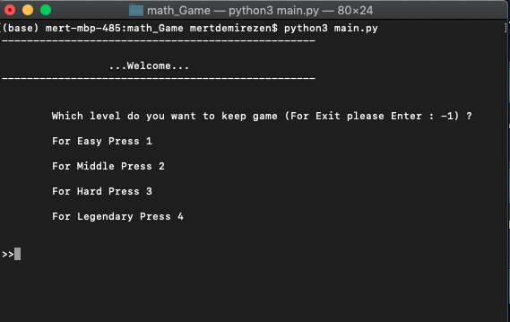
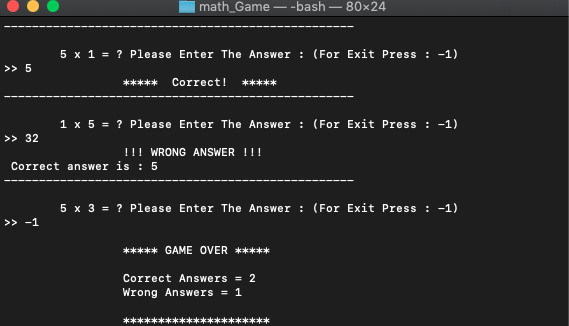

#  Math Game
## Learn the multiplication table with fun
## An example implementation of class python


## Install

**Terminal **

Clone the files

```

git clone https://github.com/demirezenmert/python_miniProject.git
python3 python_miniProject/math_game/main.py

```

## Game 





